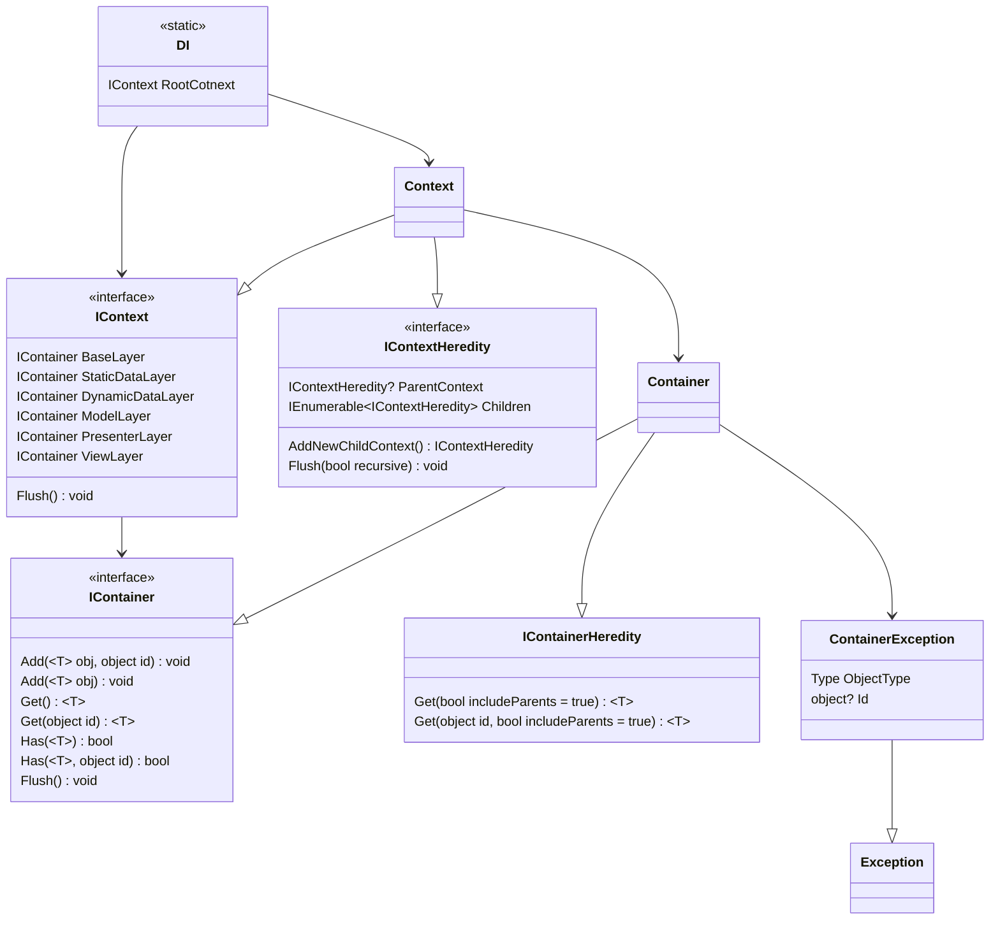

# DPDI

A simple DI system.

## DI class

This is the main access point for the system. It has a single property RootContext of type [IContext](README.md#Context).

For more info see [class diagram](README.md#Class-Diagram).

## Context

A context can be viewed as a stage of the app. It has several [containers](README.md#Container) for different purposes. Here - they are called layers. Hence, each stage of the app holds several layers of functionality. The context establishes the relations between layers.

A context can have children, thus, creating a tree-like structure. This is achieved by the [IContextHeredity](README.md#Class-Diagram) interface. All contexts implements heredity. Is possible to reimplement the context with having only the base functionality. Also, there are a couple of extension methods in ```DPDI.Context.ContextExtensions``` for easily casting the heredity context to base context

The Flush method clears the layers and propagates the flush to all its children.

For more info see [class diagram](README.md#Class-Diagram).

## Container

This is the base level where the main logic happens. The container is a place for storing instances of classes to be accessed and used in the app.

Similarly to the [context](README.md#Context), it also has ```IContainerHeredity``` functionality, but unlike the context it works the opposite way. The container heredity gives the container the ability to have one or multiple parents, from which the instances can be queried.

The container works in two modes: single and regular. Each mode has a set of methods: ```Add```, ```Get``` and ```Has```.

### Single mode

Single mode stores the object as a single instance. It does so using the Type as the key.

```Add``` method will throw ```ContainerException``` if an instance of the same type is already stored in this container (either as a single or as a regular) or in any of the parent containers.

```Get``` method will return the instance if provided type is stored in this container, or any of the parent containers. Otherwise it throws a ```ContainerException```.

```Has``` method will return a bool, indicating whether an instance of the type is stored in this container only.

### Regular mode

Reular mode can sotore multiple instances of a type as well as multiple types. To achieve this you must provide some sort of an id. The id can be any value or reference type. The regular mode utilizes buckets for each type, so the ids can be the same, provided that the types are different.

```Add``` method, similarly to the single mode will throw ```ContainerException``` if an instance of the same type, as well as an instance with the same type and id is already stored in this container (either as a single or as a regular) or in any of the parent containers.

```Get``` works the same as in single mode, but will ask for an id.

```Has``` method will return a bool, indicating whether an instance of the type with the provided id is stored in this container only.

For more info see [class diagram](README.md#Class-Diagram).

## Class diagram


